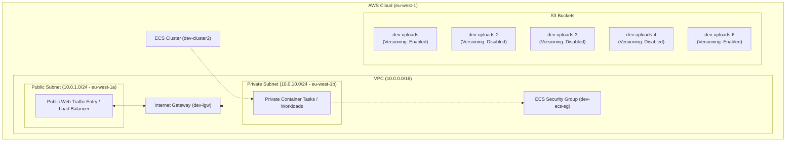

# AWS Infrastructure Documentation

- **Infrastructure overview:** Multi-tier containerized web application infrastructure with segregated networking and object storage.
- **Documentation by:** Terraform
- **Updated date:** 2026-10-06 08:42:40 UTC
- **Commit ID:** 191d5fc
- **Environment:** dev
- **AWS region:** eu-west-1

---

## VPC and networking

### Virtual Private Cloud (VPC)
- **Resource type:** `aws_vpc`
- **Resource name:** `main_vpc`
- **Location:** AWS Region `eu-west-1`
- **Purpose:** Core isolated networking environment for development resources.
- **Important settings:**
  - CIDR Block: `10.0.0.0/16`
  - DNS Hostnames: Enabled (`true`)
  - DNS Support: Enabled (`true`)
  - Instance Tenancy: `default`
  - Tags: `Name = dev-vpc`, `Environment = dev`, `ManagedBy = Terraform`

### Internet Gateway
- **Resource type:** `aws_internet_gateway`
- **Resource name:** `igw`
- **Location:** AWS Region `eu-west-1`
- **Purpose:** Provides communication between the VPC and the internet.
- **Dependencies/relationships/connections:** Associated with `aws_vpc.main_vpc`.
- **Important settings:**
  - Tags: `Name = dev-igw`

---

## Subnets

### Public Subnet
- **Resource type:** `aws_subnet`
- **Resource name:** `public-subnet`
- **Location:** Availability Zone `eu-west-1a`
- **Purpose:** Hosts public-facing resources requiring direct internet routing.
- **Dependencies/relationships/connections:** Associated with `aws_vpc.main_vpc`.
- **Important settings:**
  - CIDR Block: `10.0.1.0/24`
  - Map Public IP on Launch: Enabled (`true`)
  - Tags: `Name = dev-public-subnet`, `Type = Public`

### Private Subnet
- **Resource type:** `aws_subnet`
- **Resource name:** `private-subnet`
- **Location:** Availability Zone `eu-west-1b`
- **Purpose:** Hosts backend workloads and databases isolated from direct public internet access.
- **Dependencies/relationships/connections:** Associated with `aws_vpc.main_vpc`.
- **Important settings:**
  - CIDR Block: `10.0.10.0/24`
  - Map Public IP on Launch: Disabled (`false`)
  - Tags: `Name = dev-private-subnet`, `Type = Private`

---

## Security groups

### ECS Security Group
- **Resource type:** `aws_security_group`
- **Resource name:** `ecs_sg`
- **Location:** `aws_vpc.main_vpc`
- **Purpose:** Controls network traffic for ECS container tasks.
- **Dependencies/relationships/connections:** Associated with `aws_vpc.main_vpc`.
- **Important settings:**
  - Ingress: Port `3000` (TCP) allowed from CIDR block `10.0.0.0/16`.
  - Egress: All ports and protocols (`-1`) allowed to `0.0.0.0/0` (any destination).
  - Tags: `Name = dev-ecs-sg`

---

## Compute resources

### ECS Cluster
- **Resource type:** `aws_ecs_cluster`
- **Resource name:** `main_ecs2`
- **Location:** AWS Region `eu-west-1`
- **Purpose:** Container orchestration management for development workloads.
- **Important settings:**
  - Cluster Name: `dev-cluster2`
  - Container Insights: Enabled (`value = "enabled"`)
  - Tags: `Environment = dev`, `ManagedBy = Terraform`

---

## Storage resources

### S3 Buckets
- **Resource type:** `aws_s3_bucket`
- **Resource names:** `uploads_bucket`, `uploads_bucket_2`, `uploads_bucket_3`, `uploads_bucket_4`, `uploads_bucket_6`
- **Location:** AWS Region `eu-west-1`
- **Purpose:** Object storage for application uploads in the development environment.
- **Important settings:**
  - Force Destroy: `false`
  - Bucket Prefixes & Names:
    - `aws_s3_bucket.uploads_bucket` (`dev-uploads-bucket-`, Tags: `Name = dev-uploads`)
    - `aws_s3_bucket.uploads_bucket_2` (`dev-uploads-bucket-2`, Tags: `Name = dev-uploads-2`)
    - `aws_s3_bucket.uploads_bucket_3` (`dev-uploads-bucket-3`, Tags: `Name = dev-uploads-3`)
    - `aws_s3_bucket.uploads_bucket_4` (`dev-uploads-bucket-4`, Tags: `Name = dev-uploads-4`)
    - `aws_s3_bucket.uploads_bucket_6` (`dev-uploads-bucket-6`, Tags: `Name = dev-uploads-6`)
  - Tags: `Environment = dev`, `ManagedBy = Terraform`

### S3 Bucket Versioning
- **Resource types:** `aws_s3_bucket_versioning`
- **Resource names:** `uploads_bucket`, `uploads_bucket_2`, `uploads_bucket_3`, `uploads_bucket_4`, `uploads_bucket_6`
- **Purpose:** Configuration to enforce or disable versioning history for objects within each S3 bucket.
- **Important settings:**
  - `aws_s3_bucket_versioning.uploads_bucket`: Status **Enabled**
  - `aws_s3_bucket_versioning.uploads_bucket_2`: Status **Disabled**
  - `aws_s3_bucket_versioning.uploads_bucket_3`: Status **Disabled**
  - `aws_s3_bucket_versioning.uploads_bucket_4`: Status **Disabled**
  - `aws_s3_bucket_versioning.uploads_bucket_6`: Status **Enabled**

---

## Databases
*(Note: PostgreSQL RDS Instance and DB Subnet Group resources are not configured in this current infrastructure generation.)*

---

## Resource relationships
- `aws_internet_gateway.igw` is connected directly to `aws_vpc.main_vpc`.
- `aws_subnet.public-subnet` and `aws_subnet.private-subnet` reside within the IP block defined by `aws_vpc.main_vpc`.
- `aws_security_group.ecs_sg` is scoped inside `aws_vpc.main_vpc` and regulates ingress to ECS containers.
- Each `aws_s3_bucket_versioning` resource is explicitly bound to its target `aws_s3_bucket` (`uploads_bucket`, `uploads_bucket_2`, `uploads_bucket_3`, `uploads_bucket_4`, `uploads_bucket_6`).

---

## ARCHITECTURE DIAGRAM

